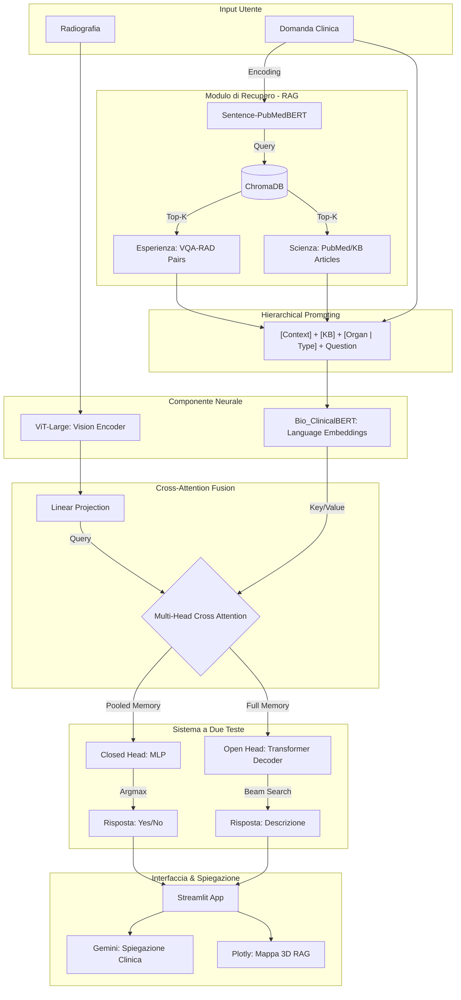

# Medical-Visual-QA

##  Architettura del Sistema




## 🩻 MedVQA — Radiology Visual Question Answering

> A multimodal deep learning system for answering clinical questions about radiology images, combining **ViT-Large** vision encoding, **Bio_ClinicalBERT** language embeddings, and **Gemini 2.5 Flash** for clinical explanation generation.

---

## 📋 Table of Contents

- [Overview](#overview)
- [Architecture](#architecture)
- [Dataset](#dataset)
- [Key Techniques](#key-techniques)
- [Training](#training)
- [Results](#results)
- [Project Structure](#project-structure)
- [Setup & Installation](#setup--installation)
- [Running the Streamlit App](#running-the-streamlit-app)
- [Configuration](#configuration)
- [Disclaimer](#disclaimer)

---

## Overview

**MedVQA** is a research project for Visual Question Answering (VQA) on medical radiology images. Given a radiology scan (X-Ray, CT, MRI) and a clinical question in natural language, the system produces an answer and a confidence score. For low-confidence or complex answers, a **Gemini 2.5 Flash** agent provides an additional clinical explanation.

The system handles two types of questions:

- **Closed questions** (yes/no): routed to a dedicated MLP classification head.
- **Open questions** (descriptive answers): routed to a Transformer decoder with beam search generation.

---

## Architecture

The model (`CustomMedVQAModel`) is a custom multimodal architecture built from scratch on top of two pre-trained encoders.

```
Radiology Image  ──► ViT-Large (google/vit-large-patch32-384)
                         │ (patch features, dim=1024)
                         ▼
                   Vision Projection (Linear 1024→768)
                         │
Clinical Question ──► Bio_ClinicalBERT Embeddings (dim=768)
                         │
                   Cross-Attention (Q=question, K/V=vision)
                         │
                   Layer Norm + Residual
                         │
                    ┌────┴────┐
                    │         │
             Closed Head   Open Head (Decoder)
              (MLP)         (TransformerDecoder, 3 layers)
                    │         │
                    └────┬────┘
                     Routing by
                    question type
                         │
                       Answer
                         │
                  Gemini 2.5 Flash
               (clinical explanation)
```

### Components

**Vision Encoder — `google/vit-large-patch32-384`**
- ViT-Large model with patch size 32 and input resolution 384×384.
- Frozen during training **except** for the last 3 transformer layers and the final LayerNorm (fine-tuning via selective unfreezing).
- Output: sequence of patch features with dimension 1024, projected to 768 via a linear layer.

**Language Encoder — `emilyalsentzer/Bio_ClinicalBERT`**
- Only the **word embeddings** are extracted from Bio_ClinicalBERT, providing biomedical-domain token representations of dimension 768.
- Questions are enriched with hierarchical context before tokenization: `[ORGAN | QUESTION_TYPE] question text`.

**Cross-Attention Fusion**
- `nn.MultiheadAttention` (8 heads, dim=768) with question features as Query and vision features as Key/Value.
- Allows the language stream to selectively attend to the most relevant image regions.

**Closed-Question Head**
- MLP: `Linear(768→256) → ReLU → Dropout(0.3) → Linear(256→vocab_size)`.
- Takes the mean-pooled memory vector and outputs a single-token prediction (e.g., "yes" / "no").
- Confidence: softmax probability of the top predicted token.

**Open-Question Head**
- `nn.TransformerDecoder` with 3 layers, 8 heads, dropout=0.271.
- Autoregressive generation with **beam search** (num_beams=5, max_len=32).
- Weight tying: `fc_out.weight = embedding.weight` (shared vocabulary projection).
- Confidence: normalized exponential of the best beam score.

**RAG (Retrieval-Augmented Generation)**
- During training, a ChromaDB vector store holds training Q&A pairs embedded via `sentence-transformers`.
- At inference time, the top-K most similar past questions (stratified by organ and answer type) are prepended to the current question as context.

**Knowledge Base (KB)**
- A separate ChromaDB collection stores domain-specific clinical knowledge snippets.
- KB context is also retrieved and prepended, providing factual medical background.

**Gemini 2.5 Flash Integration**
- After the model generates an answer, the `gemini-2.5-flash` model is called via the `google.genai` SDK.
- A structured prompt passes the question, model answer, organ, question category, answer type, and confidence score to Gemini.
- Gemini returns a 2–4 sentence clinical explanation in professional medical language.
- If confidence is below threshold, Gemini is instructed to recommend specialist verification.
- Exponential backoff (up to 3 retries) handles API rate limits.

---

## Dataset

**VQA-RAD** — Radiology Visual Question Answering dataset.

| Split      | Examples |
|------------|----------|
| Train      | 1,573    |
| Validation | 337      |
| Test       | 338      |
| **Total**  | **2,248**|

The dataset was prepared with `dataset.ipynb`:
1. Raw JSON + image folder loaded with Pillow.
2. All images converted to RGB PIL objects.
3. Structured as a HuggingFace `DatasetDict` with typed features (`Image`, `Value`).
4. Split 70% / 15% / 15% (train / validation / test) with `seed=42`.
5. Saved to disk and uploaded to HuggingFace Hub at `Angelo0102/VQA-RAD`.

**Dataset features:**

| Field           | Type   | Description                                      |
|-----------------|--------|--------------------------------------------------|
| `qid`           | string | Unique question ID                               |
| `image_name`    | string | Filename of the radiology image                  |
| `image`         | Image  | PIL radiology image (CT, MRI, X-Ray)             |
| `image_organ`   | string | Anatomical region: HEAD, CHEST, ABD              |
| `question`      | string | Clinical question in natural language            |
| `question_type` | string | Category: PRES, POS, PLANE, ABN, SIZE, ATTR, COUNT |
| `phrase_type`   | string | Phrase type label                                |
| `answer`        | string | Ground truth answer                              |
| `answer_type`   | string | CLOSED (yes/no) or OPEN (descriptive)            |

---

## Key Techniques

### Hierarchical Prompting
Questions are prefixed with organ and category metadata:
```
[HEAD | PRES] Is there a ventricle dilation visible?
```
This provides the model with explicit anatomical and semantic context at every step.

### Selective Fine-Tuning (Freezing)
All ViT-Large parameters are frozen except the last 3 encoder layers and the LayerNorm. This balances compute efficiency with fine-tuning capacity on the small medical domain dataset.

### Dual-Head Routing
The answer type (CLOSED vs OPEN) is inferred from question syntax at inference time:
- Questions starting with *is, are, was, were, does, do, has, have, can, could, did* → **CLOSED** head.
- All other questions → **OPEN** (decoder) head.

### Focal Loss with Label Smoothing
A custom `MedVQAMultiClassFocalLoss` combines:
- **Focal loss** (γ=1.88) to down-weight easy examples and focus training on hard cases.
- **Label smoothing** (ε=0.1) to prevent overconfident predictions.

### Mixed Precision Training
`torch.amp.autocast` + `GradScaler` for GPU memory efficiency.

### Gradient Accumulation
`accumulation_steps=4` to simulate a larger effective batch size.

---

## Training

| Hyperparameter        | Value                       |
|-----------------------|-----------------------------|
| Optimizer             | AdamW                       |
| Learning Rate         | 1.956 × 10⁻⁴                |
| Weight Decay          | 1.239 × 10⁻⁴                |
| LR Scheduler          | ReduceLROnPlateau (factor=0.474, patience=2) |
| Focal Loss γ          | 1.88                        |
| Label Smoothing       | 0.1                         |
| Batch Size            | 8 (×4 gradient accumulation = 32 effective) |
| Decoder Dropout       | 0.271                       |
| Max Answer Length     | 32 tokens                   |
| Beam Search Width     | 5                           |
| Epochs                | 18                          |
| Training Platform     | Kaggle (CUDA GPU)           |

**Training Loss Curve (selected epochs):**

| Epoch | Train Loss | Val Loss | LR       |
|-------|-----------|----------|----------|
| 1     | 4.1418    | 3.0060   | 1.96e-04 |
| 4     | 2.3802    | 2.3241   | 1.96e-04 |
| 7     | 1.7323    | 2.7237   | 9.27e-05 |
| 10    | 1.2879    | 2.5440   | 4.39e-05 |
| 18    | 1.0489    | 2.5975   | 9.85e-06 |

Best model checkpoint saved at epoch 4 (lowest validation loss: 2.3241).

---

## Results

Evaluated on the **test set (338 samples)** using Exact Match, BLEU-1, and BERTScore F1.

### Global Metrics

| Metric                | Score  |
|-----------------------|--------|
| Exact Match Accuracy  | 0.4024 |
| BLEU-1                | 0.4149 |
| BERTScore F1          | 0.8403 |

### With Gemini Refinement (50.6% of samples)

| Subset                        | BERTScore F1 |
|-------------------------------|-------------|
| Gemini-refined samples        | **0.9128**  |
| Non-refined samples           | 0.7661      |

### By Question Type

| Answer Type | Exact Match | BLEU-1 | BERTScore F1 |
|-------------|------------|--------|-------------|
| CLOSED      | 0.6533     | 0.6533 | **0.9385**  |
| OPEN        | 0.0432     | 0.0736 | 0.6997      |

### By Anatomical Region

| Organ | Exact Match | BLEU-1 | BERTScore F1 |
|-------|------------|--------|-------------|
| ABD   | 0.4352     | 0.4390 | 0.8448      |
| CHEST | 0.4444     | 0.4589 | **0.8591**  |
| HEAD  | 0.3173     | 0.3365 | 0.8128      |

**Note:** The model performs significantly better on closed questions. Open-question generation is a harder task, especially given the limited training data (< 2,000 examples). Gemini refinement consistently improves BERTScore by ~15 points on the refined subset.

### Confidence Thresholds

| Answer Type | Threshold |
|-------------|-----------|
| CLOSED      | 80%       |
| OPEN        | 50%       |

If confidence is below threshold, the app displays a warning and Gemini explicitly suggests specialist verification.

---

## Project Structure

```
medvqa/
│
├── app.py                  # Streamlit web application
├── medicalvqa.ipynb        # Training notebook (Kaggle)
├── dataset.ipynb           # Dataset preparation and HF upload
├── requirements.txt        # Python dependencies
│
└── models/
    └── best_vqa_model.pth  # Trained model weights (~1.4 GB)
```

---

## Setup & Installation

### Prerequisites

- Python 3.10+
- CUDA-capable GPU recommended (CPU inference is supported but slow)
- A valid **Google Gemini API key** ([get one here](https://aistudio.google.com/))
- The trained model weights file: `best_vqa_model.pth` (~1.4 GB)

### 1. Clone the Repository

```bash
git clone https://github.com/angelopaldino/Medical-Visual-QA.git
cd medvqa
```

### 2. Create a Virtual Environment (recommended)

```bash
python -m venv venv

# Windows
venv\Scripts\activate

# macOS / Linux
source venv/bin/activate
```

### 3. Install Dependencies

```bash
pip install -r requirements.txt
```

The `requirements.txt` should contain:

```txt
streamlit
torch
torchvision
transformers
Pillow
google-genai
datasets
sentence-transformers
chromadb
bert-score
```

> **Note:** For GPU support, install the appropriate PyTorch version from [pytorch.org](https://pytorch.org/get-started/locally/) before running the above command.

### 4. Download Model Weights

Place the trained model weights at the path configured in `app.py`:

```
models/best_vqa_model.pth
```

Or update `MODEL_PATH` in `app.py` to point to wherever you saved the `.pth` file.

---

## Running the Streamlit App

### 1. Configure the App

Open `app.py` and update the following constants at the top of the file:

```python
GEMINI_API_KEY = "your-gemini-api-key-here"
MODEL_PATH     = "/path/to/your/best_vqa_model.pth"
```

### 2. Launch the App

```bash
streamlit run app.py
```

The app will open automatically in your browser at `http://localhost:8501`.

### 3. Using the App

1. **Upload a radiology image** (PNG, JPG, JPEG) — supports X-Ray, CT, and MRI scans.
2. **Enter a clinical question** in English, e.g.:
   - `Is there a fracture visible?`
   - `Where is the lesion located?`
   - `What is the size of the mass?`
3. **Select the anatomical region**: Head/Brain, Chest/Lung/Heart, or Abdomen.
4. Click **"Analizza immagine →"** to run inference.

The right panel will display:
- The **model answer**
- **Confidence score** with a color-coded progress bar (green ≥ threshold, yellow marginal, red below threshold)
- **Answer type** (CLOSED / OPEN), **detected organ**, and **question category**
- A **clinical explanation** generated by Gemini 2.5 Flash

> ⚠️ The first inference may take 30–60 seconds as the model (~1.4 GB) loads into memory. Subsequent queries are fast thanks to Streamlit's `@st.cache_resource`.

---

## Configuration

| Constant                      | Default                         | Description                                  |
|-------------------------------|---------------------------------|----------------------------------------------|
| `GEMINI_API_KEY`              | *(set your key)*                | Google Gemini API key                        |
| `GEMINI_MODEL`                | `gemini-2.5-flash`              | Gemini model version                         |
| `MODEL_PATH`                  | *(set your path)*               | Path to the `.pth` model weights file        |
| `DEVICE`                      | Auto (CUDA if available)        | Inference device                             |
| `CONFIDENCE_THRESHOLD_CLOSED` | `0.80`                          | Min confidence for closed questions (80%)    |
| `CONFIDENCE_THRESHOLD_OPEN`   | `0.50`                          | Min confidence for open questions (50%)      |

---

## Disclaimer

> **This system is intended for research purposes only and must not be used for clinical diagnosis.**
> All outputs should be reviewed and validated by a qualified radiologist or medical professional.
> The model was trained on the VQA-RAD dataset which is limited in size and scope.

---

## References

- **VQA-RAD Dataset**: Lau et al., "A Dataset of Clinically Generated Visual Questions and Answers about Radiology Images", *Scientific Data*, 2018.
- **ViT-Large**: Dosovitskiy et al., "An Image is Worth 16x16 Words", ICLR 2021. [`google/vit-large-patch32-384`](https://huggingface.co/google/vit-large-patch32-384)
- **Bio_ClinicalBERT**: Alsentzer et al., "Publicly Available Clinical BERT Embeddings", 2019. [`emilyalsentzer/Bio_ClinicalBERT`](https://huggingface.co/emilyalsentzer/Bio_ClinicalBERT)
- **Gemini**: Google DeepMind, `gemini-2.5-flash` via Google AI Studio.
- **HuggingFace Dataset**: [`Angelo0102/VQA-RAD`](https://huggingface.co/datasets/Angelo0102/VQA-RAD)
